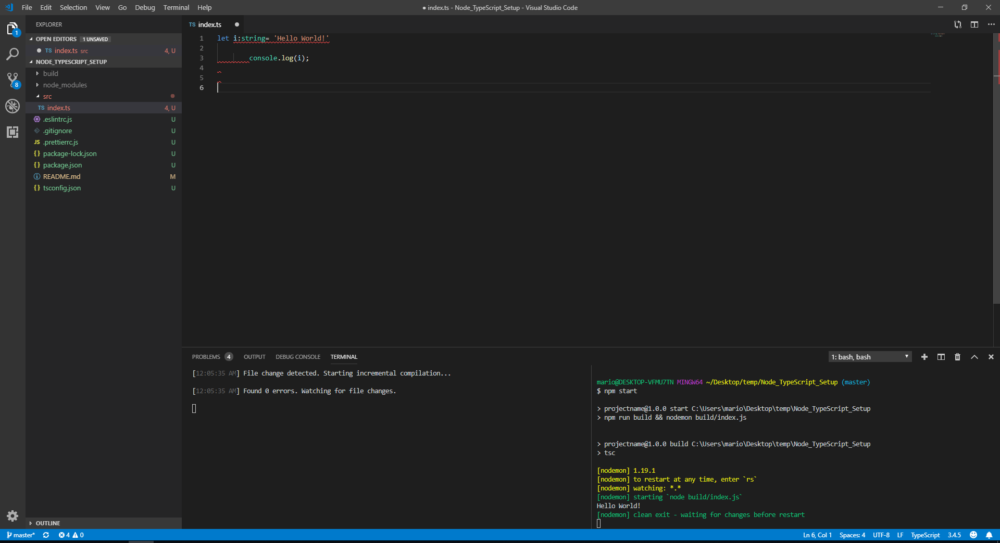

# Node_TypeScript_Setup

Custom setup for node projects using typescript... on steroids!

Developer Dependecies used:
* typescript for obvious reasons
* eslint @typescript-eslint/parser @typescript-eslint/eslint-plugin for linting
* prettier eslint-config-prettier eslint-plugin-prettier for code formatting
* nodemon for lively running the project

Recommendations:
* delete res1.png and res2.png
* update this README file and the project info in package.json
* run npm i
* use vscode and install ESLint extension
* edit %APPDATA%\Code\User\settings.json and add the following for lively linting and formatting the code:

"eslint.autoFixOnSave": true,
"eslint.validate": [
    "javascript",
    {
        "language": "typescript",
        "autoFix": true
    }
]

* use two terminals:
    * run "npm run build-live" in the first one for lively building the project
    * run "npm start" in the second one for lively running the project

When all of the above is completed every time the project is saved the following will occur:
* All linting and formatting issues will be automatically fixed (if possible)
* The project will be compiled to JS and run
* The first terminal will show all typescript compilation issues allowing direct access to said errors in the .ts files
* The second terminal will show all stdout info from the .js files

Final expected result:

Before CTRL+S

After CTRL+S

